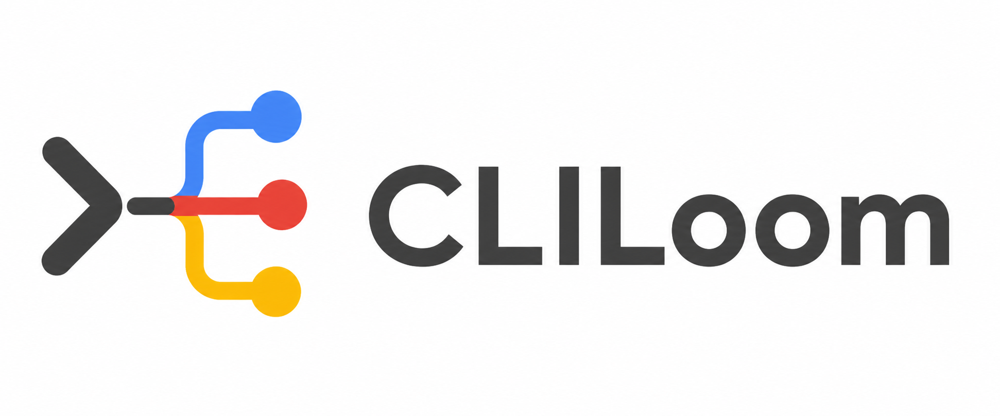
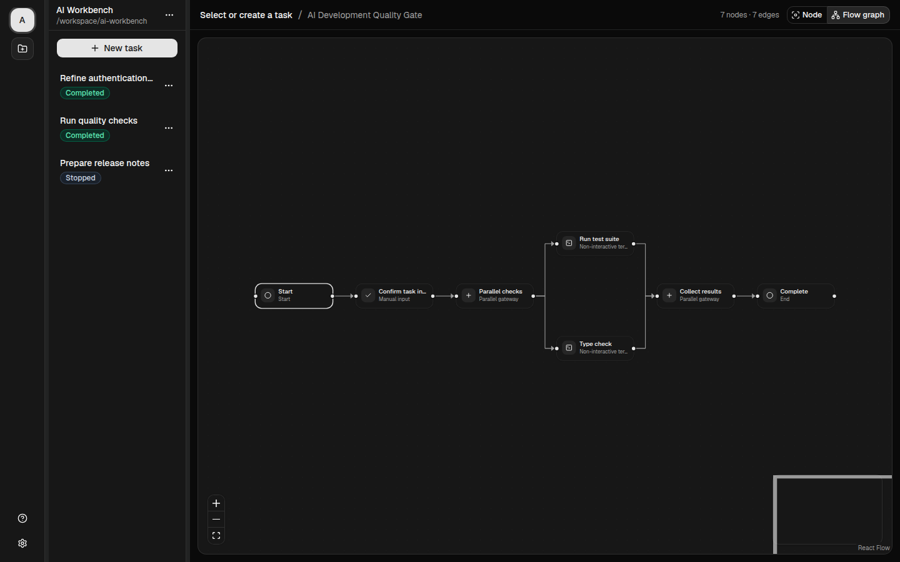
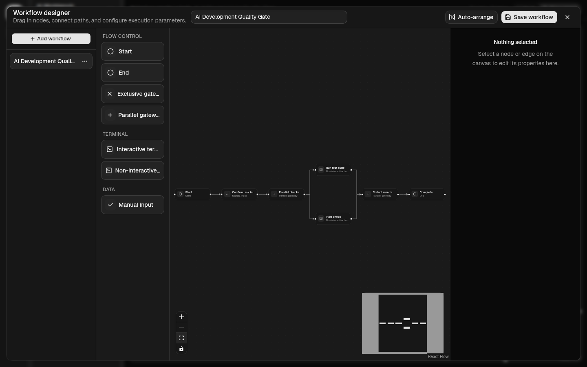
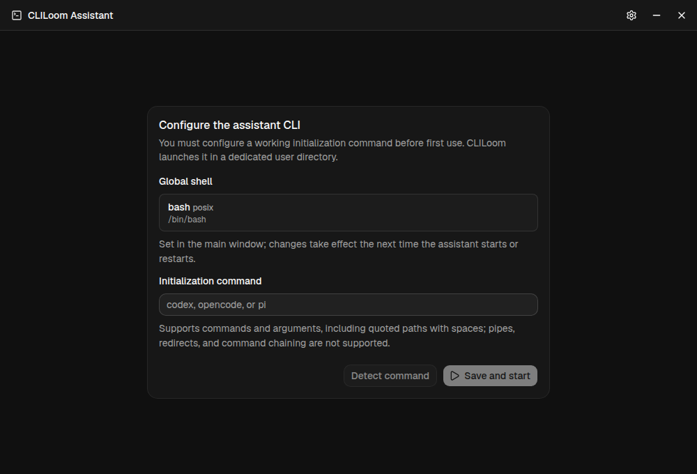

<p align="center">
  
</p>

<p align="center">
  Bring AI CLIs, visual workflows, and real terminals into one desktop workspace.
</p>

<p align="center">
  <strong>English</strong> | <a href="README.zh-CN.md">简体中文</a>
</p>

## 1. Overview

CLILoom is a cross-platform desktop workspace built for AI-assisted CLI development.

It turns terminal commands, human input, and automation steps into reusable visual workflows. Design and run those workflows in a project and task context, inspect real terminal output, and step into an interactive terminal whenever human judgment is needed.

Whether you are working with an AI coding assistant, running builds and tests, or coordinating conditional and parallel jobs, CLILoom keeps the whole process visible, controllable, and repeatable.

## 2. Why CLILoom

### See the whole process

Replace steps scattered across scripts, terminal windows, and runbooks with a workflow you can inspect and edit. Command order, decision points, and parallel paths stay visible on the canvas.

### Combine automation with human input

Use non-interactive terminal nodes for unattended commands, then pause for parameters or continue in a fully interactive terminal when a task needs your attention.

### Keep every task in context

Organize work by project and task. CLILoom retains the workflow version, runtime status, terminal sessions, and historical output associated with each run.

### Use your preferred AI CLI

Launch an installed AI CLI or another command-line tool through a configurable initialization command in a dedicated assistant window. CLILoom does not tie the workflow to a single model or provider.

### Work across operating systems

Run CLILoom on macOS, Windows, or Linux with native shells including PowerShell, cmd, sh, bash, zsh, and Git Bash.

### Keep workspace data local

Projects, tasks, workflows, settings, and runtime records are stored locally in SQLite. Local does not mean encrypted: commands, variables, environment values, and terminal output can be retained as plaintext. The interface also includes English and Simplified Chinese, built-in themes, and reusable custom skins.

## 3. Interface Preview

### Main workspace



Manage projects, previous tasks, workflow execution, and terminal output from one workspace.

### Workflow designer



Build reusable workflows by arranging nodes, connecting paths, and editing execution settings.

### AI CLI assistant



Configure your preferred AI CLI and run it in a dedicated interactive terminal window.

## 4. Features

- **Visual workflow designer**
  - Create, copy, edit, and automatically arrange workflows.
  - Drag nodes onto the canvas, connect paths, and validate configurations before saving.

- **Purpose-built node types**
  - Start, end, manual input, interactive terminal, and non-interactive terminal nodes.
  - Exclusive gateways for conditional routing and parallel gateways for concurrent branches and joins.

- **Real terminal execution**
  - Interactive PTY sessions with keyboard input and responsive resizing.
  - Per-node working directories, environment variables, timeouts, and accepted exit codes.
  - Persisted terminal output and safe retries for historical commands.
  - Native-shell target snapshots shared by terminals, hooks, retries, and the AI CLI assistant.

- **Variables and hooks**
  - Text and number variables with labels, defaults, ordering, and required rules.
  - Consistent `${variable}` bindings across supported shells without directly concatenating values into shell source.
  - Start and end hooks with configurable failure behavior.

- **Traceable projects and tasks**
  - Project-specific default workflows and retained task history.
  - Persisted workflow versions, task status, terminal sessions, and runtime state.

- **Configurable AI CLI assistant**
  - Validate and launch a custom initialization command.
  - Start, stop, and restart the assistant in its own terminal window.
  - Share shell, language, and appearance settings with the main application.

- **Cross-platform and customizable**
  - Build targets for macOS, Windows, and glibc-based Linux on x64 and ARM64.
  - English and Simplified Chinese interfaces.
  - Built-in light and dark themes plus custom skin import and export.

## 5. Download and Installation

Use the stable [latest GitHub Release](https://github.com/laurentwu/CLILoom/releases/latest) page to check for published installers. If GitHub reports that no release exists, installation packages are not currently available.

| Operating system | Architecture | Package formats | Release page |
| --- | --- | --- | --- |
| macOS | Apple Silicon | DMG, ZIP | [Check latest release](https://github.com/laurentwu/CLILoom/releases/latest) |
| macOS | Intel | DMG, ZIP | [Check latest release](https://github.com/laurentwu/CLILoom/releases/latest) |
| Windows | ARM64 | Installer, portable EXE | [Check latest release](https://github.com/laurentwu/CLILoom/releases/latest) |
| Windows | x64 | Installer, portable EXE | [Check latest release](https://github.com/laurentwu/CLILoom/releases/latest) |
| Linux | ARM64 | AppImage, DEB, RPM | [Check latest release](https://github.com/laurentwu/CLILoom/releases/latest) |
| Linux | x64 | AppImage, DEB, RPM | [Check latest release](https://github.com/laurentwu/CLILoom/releases/latest) |

### macOS

Download the DMG, open it, and drag CLILoom into the Applications folder. The ZIP package can be extracted and moved manually instead.

CLILoom release builds are currently not Apple-signed or notarized. On first launch, macOS may require approval under **System Settings → Privacy & Security**. macOS 12 Monterey or newer is required.

### Windows

Use the installer for a standard installation, or download the portable EXE to run CLILoom without installing it.

Windows release builds are currently unsigned, so Microsoft Defender SmartScreen may display an unknown-publisher warning. Confirm that the file came from the CLILoom GitHub Releases page before continuing.

### Linux

Choose the package for your distribution:

```sh
# Portable AppImage
chmod +x ./CLILoom-*.AppImage
./CLILoom-*.AppImage

# Debian or Ubuntu
sudo apt install ./CLILoom-*.deb

# Fedora or another RPM-based distribution
sudo dnf install ./CLILoom-*.rpm
```

Linux packages require glibc; Ubuntu 24.04 or an equivalent environment is recommended. Alpine Linux and other musl-based distributions are not supported. The AppImage is portable and requires the host to permit Chromium's user-namespace sandbox. Ubuntu 23.10 and newer block that capability for downloaded applications by default; use the DEB package there unless you have explicitly configured an AppArmor policy for the AppImage. DEB and RPM install Electron's root-owned SUID sandbox helper. CLILoom never falls back to `--no-sandbox`.

## 6. Security and local data

CLILoom intentionally executes workflow commands and configured assistant CLIs with your operating-system account. Those processes are not contained by the Electron renderer sandbox. The local SQLite database is not application-encrypted and can retain commands, variables, configured environment values, and terminal transcripts in plaintext.

Review executable inputs before running them, avoid placing long-lived credentials directly in persisted workflows, and use full-disk encryption when the device handles sensitive data. See the [security model](SECURITY_MODEL.md) for trust boundaries, local-data permissions, retention, and deletion guidance.

## Friendly Links

- [LINUX DO](https://linux.do/)
