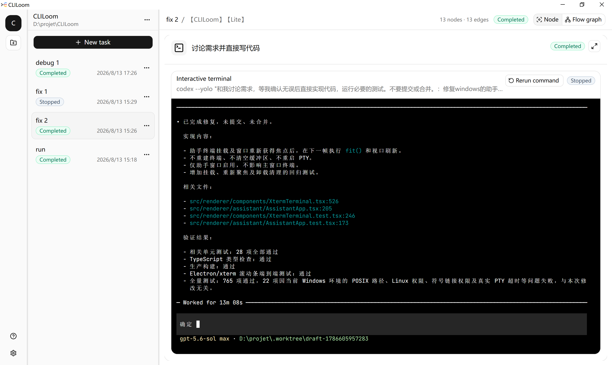
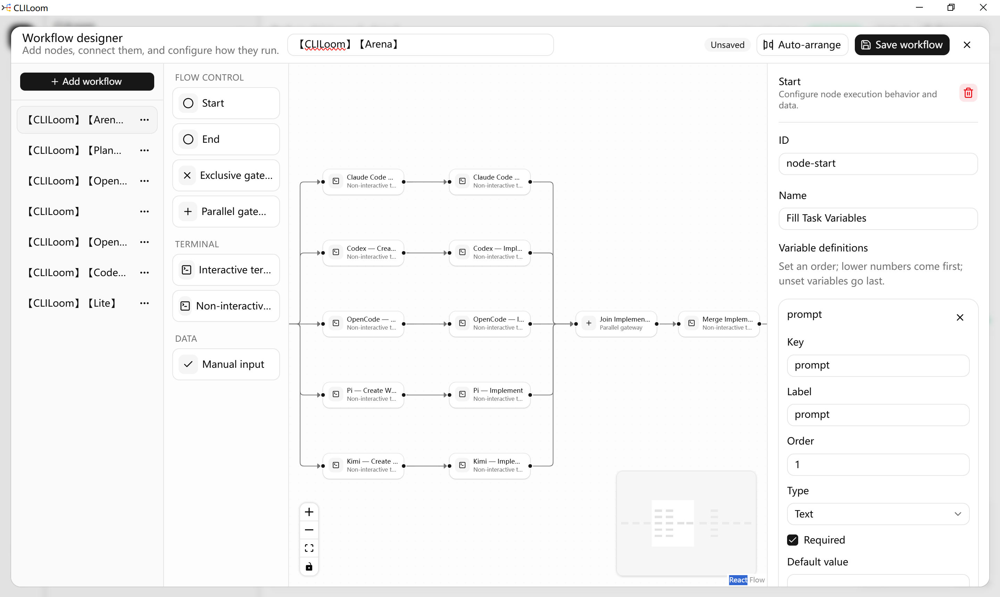
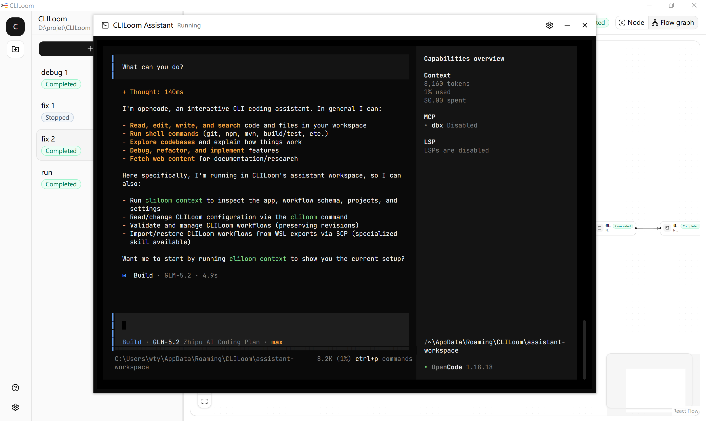

<p align="center">
  
</p>

<p align="center">
  <a href="README.md">English</a> | <strong>简体中文</strong>
</p>

## 1. 简介

CLILoom 是一款用于可视化编排、运行和管理 AI CLI 开发任务的跨平台桌面应用。

## 2. 为什么选择 CLILoom

- **可视化工作流**：清晰编排命令、条件和并行任务，并可重复使用。
- **自然语言定制工作流**：告诉 AI CLI 助手你的需求，即可轻松创建或调整专属工作流。
- **并行真实终端**：在同一页面查看多个并行分支的实时终端输出。
- **自动化与人工协作**：自动执行命令，需要时接收输入或进入交互式终端。
- **全程保留上下文**：记录工作流版本、运行状态、终端会话和历史输出。
- **支持常用 AI CLI**：通过自定义命令启动 Codex 等已安装的命令行助手。
- **跨平台、本地存储**：支持 macOS、Windows 和 Linux，工作空间数据保存在本机。

## 3. 界面预览

### 主工作区



在同一个工作空间中管理项目、历史任务、工作流执行和终端输出。

### 流程设计器



通过排列节点、连接路径和编辑执行设置来构建可复用的工作流。

### AI CLI 助手



配置你熟悉的 AI CLI，并在独立的交互式终端窗口中运行它。

## 4. 功能特性

- **可视化工作流设计器**
  - 创建、复制、编辑和自动排列工作流。
  - 将节点拖入画布、连接路径，并在保存前验证配置。

- **面向开发流程的节点类型**
  - 支持开始、结束、人工输入、交互式终端和非交互式终端节点。
  - 使用条件网关选择分支，通过并行网关同时执行和汇合多条路径。

- **真实终端执行**
  - 支持键盘输入和自适应尺寸的交互式 PTY 会话。
  - 为每个节点配置工作目录、环境变量、超时时间和成功退出码。
  - 保存终端输出，并对历史命令进行安全重试。
  - 终端、Hook、历史重试和 AI CLI 助手共享原生 Shell 目标快照。

- **变量与 Hook**
  - 定义文本和数字变量，并设置标签、默认值、排列顺序和必填规则。
  - 在所有受支持的 Shell 中使用一致的 `${variable}` 绑定，变量值不会被直接拼接到 Shell 源码中。
  - 配置节点执行前后的 Hook 及其失败处理方式。

- **可追踪的项目与任务**
  - 为项目设置默认工作流，并保留任务历史。
  - 持久化工作流版本、任务状态、终端会话和运行状态。

- **可配置的 AI CLI 助手**
  - 检测并启动自定义初始化命令。
  - 在独立终端窗口中启动、停止和重启助手。
  - 与主应用共享 Shell、语言和外观设置。

- **跨平台与个性化**
  - 构建目标覆盖 macOS、Windows 和基于 glibc 的 Linux，支持 x64 与 ARM64。
  - 支持英文和简体中文界面。
  - 提供内置明暗主题以及自定义皮肤导入导出。

## 5. 下载与安装

请通过稳定的 [GitHub 最新版本](https://github.com/laurentwu/CLILoom/releases/latest) 页面查看已发布的安装包。如果 GitHub 提示尚无 Release，说明当前还没有可下载的安装包。

| 操作系统 | 架构 | 安装包格式 | 发布页面 |
| --- | --- | --- | --- |
| macOS | Apple 芯片 | DMG、ZIP | [查看最新版本](https://github.com/laurentwu/CLILoom/releases/latest) |
| macOS | Intel | DMG、ZIP | [查看最新版本](https://github.com/laurentwu/CLILoom/releases/latest) |
| Windows | ARM64 | 安装版、便携版 EXE | [查看最新版本](https://github.com/laurentwu/CLILoom/releases/latest) |
| Windows | x64 | 安装版、便携版 EXE | [查看最新版本](https://github.com/laurentwu/CLILoom/releases/latest) |
| Linux | ARM64 | AppImage、DEB、RPM | [查看最新版本](https://github.com/laurentwu/CLILoom/releases/latest) |
| Linux | x64 | AppImage、DEB、RPM | [查看最新版本](https://github.com/laurentwu/CLILoom/releases/latest) |

CLILoom 仅在你点击**设置 → 检查更新**时访问更新服务，启动和后台均不会自动检查。Windows 安装版与 Linux AppImage 发现新版后会自动下载，并等待你确认**重启并更新**；Windows 便携版、macOS、DEB 和 RPM 只会打开对应的 GitHub Release，由你手动安装。如果 Windows 安装时选择了“所有用户”，在明确确认更新后启动安装程序时可能出现 Windows UAC 提示；仅为当前用户安装则不需要提权。CLILoom 不会为了更新自行运行系统包管理器。

### macOS

下载并打开 DMG，然后将 CLILoom 拖入“应用程序”文件夹。也可以解压 ZIP 后手动移动应用。

CLILoom 的发布构建当前尚未进行 Apple 代码签名或公证。首次启动时，macOS 可能要求你在“系统设置 → 隐私与安全性”中允许打开。最低支持 macOS 12 Monterey。

### Windows

安装版会打开分步安装向导，默认仅为当前用户安装，也可选择为所有用户安装，后者需要 Windows 管理员授权。你可以选择安装目录及是否创建桌面快捷方式；开始菜单快捷方式会始终创建。完成页还可选择是否立即启动 CLILoom。如果不希望安装，也可以下载便携版 EXE 直接运行。

Windows 发布构建当前尚未签名，因此 Microsoft Defender SmartScreen 可能显示未知发布者警告。继续运行前，请确认文件来自 CLILoom 的 GitHub Releases 页面。

### Linux

请根据使用的发行版选择安装包：

```sh
# 便携式 AppImage
chmod +x ./CLILoom-*.AppImage
./CLILoom-*.AppImage

# Debian 或 Ubuntu
sudo apt install ./CLILoom-*.deb

# Fedora 或其他基于 RPM 的发行版
sudo dnf install ./CLILoom-*.rpm
```

Linux 安装包需要 glibc，推荐使用 Ubuntu 24.04 或同等环境；暂不支持 Alpine Linux 等基于 musl 的发行版。AppImage 无需安装，但系统必须允许 Chromium 使用 user namespace 沙箱。Ubuntu 23.10 及更高版本默认会阻止下载的应用使用该能力；除非你已为 AppImage 显式配置 AppArmor 策略，否则请在这些系统上使用 DEB。DEB 和 RPM 会安装由 root 所有、启用 SUID 的 Electron 沙箱辅助程序。CLILoom 始终不会降级使用 `--no-sandbox`。

## 6. 安全与本地数据

CLILoom 会有意使用你的操作系统账户权限执行工作流命令和已配置的助手 CLI；这些子进程不受 Electron 渲染器沙箱约束。本地 SQLite 数据库没有应用层加密，其中可能以明文保留命令、变量、已配置的环境值和终端记录。

运行前请审查可执行输入，不要把长期凭据直接写入会持久化的工作流；设备处理敏感数据时，应启用全盘加密。信任边界、本地数据权限、保留和删除说明请参阅[安全模型](SECURITY_MODEL.md)。

## 友情链接

- [LINUX DO](https://linux.do/)
